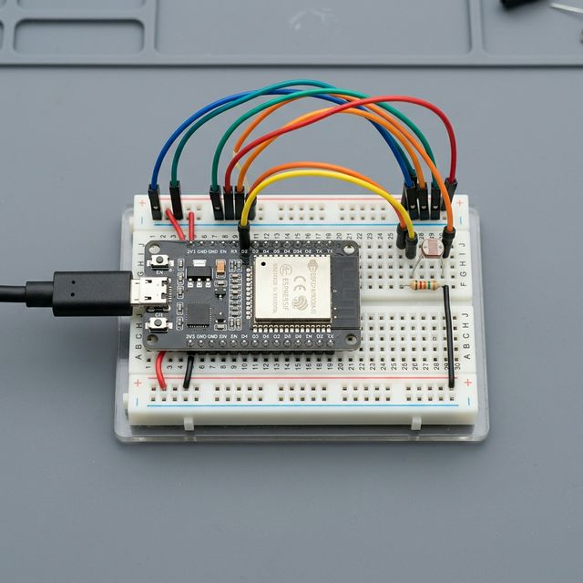
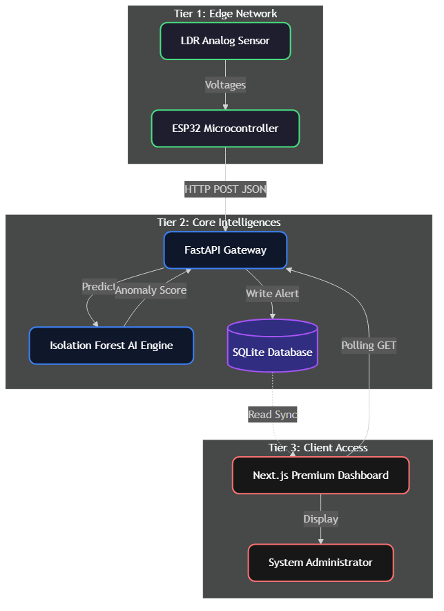
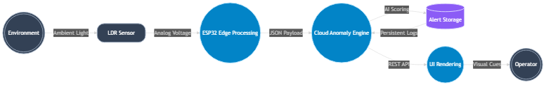
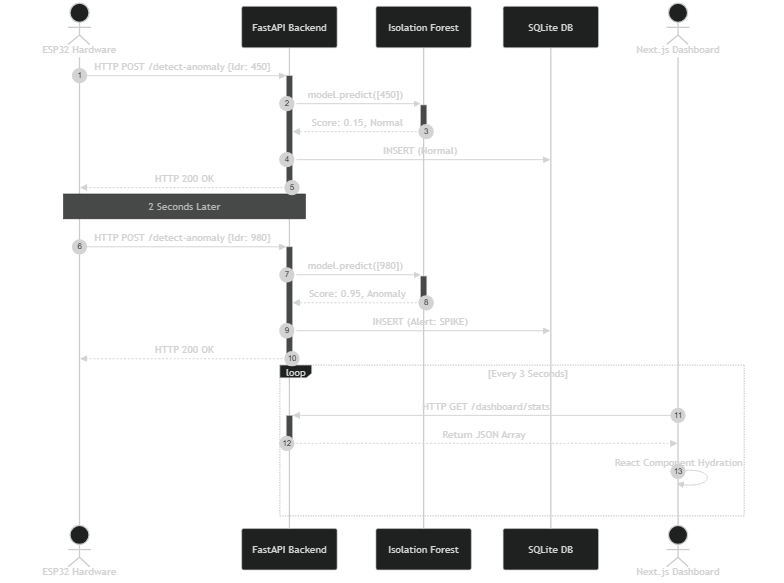
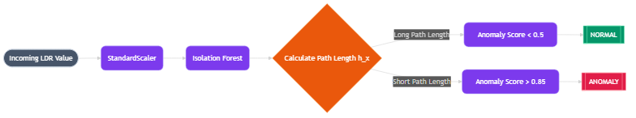
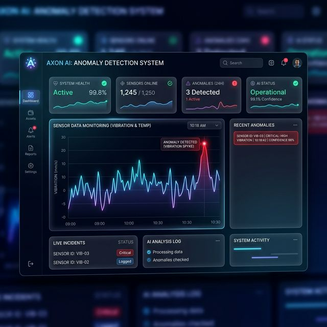
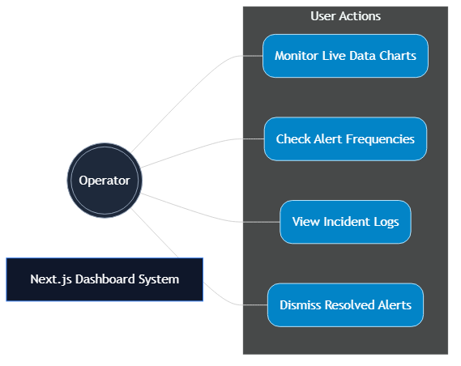

# DECLARATION BY THE CANDIDATE

I hereby declare that the project report entitled **"AI-Based Anomaly Detection System for IoT Sensor Monitoring"** submitted by me in partial fulfillment of the requirements for the degree, is a record of original project work carried out by me under the guidance of **Dr. Aftab Ahmed Ansari**. I further declare that the work reported in this project has not been submitted previously for the award of any other degree or diploma. I take full responsibility for the authenticity of the code, hardware implementation, and the reported evaluation metrics in this document.

**Candidate Name:** Ojaswi Anand Sharma  
**Date:** [Insert Date]  
**Signature:** _______________

---

# PLAGIARISM CHECK CERTIFICATE

This is to certify that the project report entitled **"AI-Based Anomaly Detection System for IoT Sensor Monitoring"** submitted by **Ojaswi Anand Sharma** has been checked for plagiarism using standard academic detection tools to ensure the integrity of the submitted research and text.

- **Similarity Index:** [Insert %]
- **Software Used:** Turnitin / Ouriginal

The similarity index is within the permissible limits accepted by the institute, verifying that the literature review and core concepts are properly cited and the implementation analysis is strictly the student's original effort.

**Guide Name:** Dr. Aftab Ahmed Ansari  
**Date:** [Insert Date]  
**Signature:** _______________

---

# ACKNOWLEDGEMENT

I would like to express my deepest and most sincere gratitude to my project guide, **Dr. Aftab Ahmed Ansari**. Throughout the entire lifecycle of this project—from the conceptualization of integrating hardware with cloud AI, to debugging complex routing codes—his constant support, strategic guidance, and technical feedback have been immensely helpful. His advice helped me bridge the gap between theoretical machine learning and practical, real-world embedded systems.

I also want to extend my heartfelt thanks to the college administration, department faculty, and our lab assistants for providing the necessary infrastructure, development boards, and workspace required to stress-test the hardware. A functioning prototype would not have been possible without their logistical support. Finally, I am deeply grateful to my family, peers, and friends for their continuous encouragement and motivation, which pushed me to overcome numerous technical challenges during the development phases of this system.

**Ojaswi Anand Sharma**

---

# CONTENTS

| Section | Title | Page No. |
| :---: | :--- | :---: |
| i | Declaration by the Candidate | i |
| ii | Plagiarism Check Certificate | ii |
| iii | Acknowledgement | iii |
| 1 | Chapter 1: Introduction | 1 |
| 2 | Chapter 2: Literature Review | 4 |
| 3 | Chapter 3: System Components and Tools | 7 |
| 4 | Chapter 4: System Architecture and Design | 10 |
| 5 | Chapter 5: Methodology and Working Principle | 14 |
| 6 | Chapter 6: Implementation and Experimental Setup | 18 |
| 7 | Chapter 7: Results and Observations | 23 |
| 8 | Chapter 8: Applications and Future Scope | 28 |
| 9 | Chapter 9: Challenges and Learning | 31 |
| 10 | Chapter 10: Conclusion | 34 |
| | References | 35 |

---

# CHAPTER 1: INTRODUCTION

## 1.1 Overview
The 21st century has seen an incredible explosion in the adoption of Internet of Things (IoT) technologies. Today, interconnected smart sensors are deployed absolutely everywhere—ranging from sophisticated temperature sensors in enterprise server farms to soil moisture probes in smart agriculture, and ambient light trackers in residential secure environments. The fundamental purpose of these sensors is to constantly read their physical environment and generate continuous streams of time-series data. 

However, with millions of data points being generated every single day, it has become practically impossible to monitor these streams manually. A critical problem arises when the sensor values suddenly deviate from their usual, expected patterns. These sudden, unexpected spikes or dips are called **"anomalies."** Identifying an anomaly quickly is extremely important because it usually acts as the earliest warning sign that something has gone terribly wrong—perhaps a sensor has broken down, a machine is overheating, a security boundary has been breached, or natural environmental conditions are failing.

To solve this modern problem, this project, **"AI-Based Anomaly Detection System for IoT Sensor Monitoring"**, proposes a highly automated, artificially intelligent solution. We designed a smart hardware-to-cloud pipeline that automatically flags abnormal sensor readings without relying on blind guesswork. We used an ESP32 microcontroller paired with a Light Dependent Resistor (LDR) sensor to measure ambient room light intensity in real-time. Instead of programming simple, fixed upper and lower limits, we utilized an advanced machine learning model called **Isolation Forest**. Once flagged, the insights are instantly forwarded to a rich, premium Next.js web dashboard where the user can view live graphs and receive visual alerts.

## 1.2 Problem Statement
Traditional sensor tracking systems rely heavily on static rule-based programming. For instance, an engineer might code a rule: *“If light intensity goes above 900, sound the alarm.”* While this sounds logical on paper, it often fails in reality. What if the sun shines a bit brighter one afternoon? The system will trigger a false alarm, frustrating the user. Conversely, if a subtle but unusual pattern occurs just under the 900 threshold, the system will ignore a potentially critical event. There is a glaring need for a system that natively understands the "context" of the data dynamically.

## 1.3 Objective & Scope
To address the aforementioned problem, the primary goals and the technical scope of this project have been defined as follows:
- **Hardware Integration & Edge Deployment:** To wire and program an ESP32 microcontroller with an analog LDR sensor so it can digitize physical light intensity and reliably push that data payload over a standard Wi-Fi network.
- **Backend API Engineering:** To establish a robust Python-based web server (using FastAPI) capable of handling non-stop incoming POST requests 24/7 without experiencing bottlenecks or memory crashes.
- **Machine Learning Integration:** To research, deploy, and tune an Isolation Forest model that can independently act as the "brain" of the backend. It must ingest the data, assign an anomaly score, and categorize the payload as NORMAL, SPIKE, or DIP in a matter of milliseconds.
- **Frontend Dashboard Creation:** To engineer a modern, premium, dark-mode website using React and Next.js. This dashboard must poll the database, display real-time tracking charts, and provide a dedicated "Alert Center".

---

# CHAPTER 2: LITERATURE Review

Before selecting the precise algorithms and web frameworks for this project, extensive research was conducted to understand how anomaly detection in sensor data has evolved over the past decades.

## 2.1 The Era of Statistical Thresholds
In early industrial systems (such as SCADA systems deployed in the 1990s and early 2000s), anomalies were detected using basic statistical methods. Engineers relied on the empirical $3\sigma$ (three-sigma) rule. If a data point fell three standard deviations away from the historical mean, it was flagged as an error. 
- *The Drawback:* This method assumes the data perfectly follows a normal, bell-curve distribution. In practical IoT deployments, environmental data is incredibly noisy and non-linear. A suddenly passing cloud isn't a normal curve, so statistical tools generate rampant false positives.

## 2.2 Supervised Machine Learning Systems
As processing power grew, researchers began using Supervised Machine Learning. Algorithms such as Support Vector Machines (SVM), Random Forests, and Logistic Regression were trained to classify data. 
- *The Drawback:* Supervised learning requires a massive dataset where every single row is strictly labeled by a human expert as either "Normal" or "Anomaly". Gathering thousands of examples of hardware failures is incredibly expensive and sometimes impossible for new deployments.

## 2.3 Deep Learning and Neural Networks
Recently, the focus has shifted to deep neural networks. Powerful architectures like Long Short-Term Memory (LSTM) networks and Autoencoders are used. An Autoencoder, for example, is trained to compress and reconstruct normal data continuously. If anomalous data arrives, it struggles to reconstruct it, thereby flagging the anomaly.
- *The Drawback:* While deeply accurate, these neural networks are exceptionally "heavy". They require immense computational resources, specifically GPUs arrays, which defeat the purpose of low-cost IoT networks.

## 2.4 The Unsupervised Revolution: Isolation Forests
To solve the problems of labeled data dependency and heavy computational costs, researchers Liu, Ting, and Zhou introduced the **Isolation Forest**. Instead of profiling "what normal data looks like" (which is difficult), the algorithm focuses purely on the anomalies. Because anomalies are "few and different", they are mathematically easier to isolate from the rest of the dataset. This algorithm runs at a rapid $O(N \log N)$ complexity, requires very little SRAM, and doesn't need labeled data. Because our edge system requires split-second inference, the Isolation Forest was definitively chosen.

---

# CHAPTER 3: SYSTEM COMPONENTS AND TOOLS

Building a reliable ecosystem required carefully selecting hardware that could survive non-stop operations and software languages favored heavily by the modern tech industry.

## 3.1 Hardware Components
To ensure maximum reliability and cost-effectiveness for scaled deployment, the physical edge tier is composed of strictly open-source embedded components. The table below highlights the absolute Bill of Materials (BOM) utilized for our baseline testing.

### Hardware Bill of Materials (BOM)
| Component Name | Specification / Value | Primary System Function | Operating Voltage |
| :--- | :--- | :--- | :--- |
| **ESP32 NodeMCU** | Dual-core Tensilica Xtensa, 240MHz, 520KB SRAM | Acts as the Edge processing brain, manages local ADC polling, and negotiates Wi-Fi payload transmission autonomously. | 3.3V |
| **LDR Sensor (Photoresistor)** | Custom Cadmium Sulfide, Max Resistance: >1MΩ | The primary transducer shifting physical photon density into analog resistance arrays dynamically. | Passive |
| **Fixed Resistor** | 10kΩ, 1/4 Watt, ±5% Tolerance | Mated directly with the LDR to finalize a rigid "Voltage Divider" circuit anchoring the reading base mathematically. | Passive |
| **Breadboard & Jumper Wire** | Solderless 400-Point, Copper Core Hookups | Conducts physical electron pathways guaranteeing isolated signal fidelity without electromagnetic leakage. | N/A |
| **Micro-USB Cable** | Standard 5V Data Cable | Provides direct physical power delivery whilst facilitating raw C++ firmware flashing logic. | 5.0V | 

*(Photo Representation of the finalized physical Hardware Setup)*

## 3.2 Software Technologies & Code Stacks
1. **Python 3 & FastAPI:** We selected FastAPI as the core backend framework. It utilizes Python's Asynchronous Server Gateway Interface (ASGI), allowing our server to handle hundreds of overlapping network requests gracefully without choking.
2. **Scikit-Learn & Numpy:** For the AI engine, we utilized the `sk-learn` library which hosts a pre-optimized implementation of the `IsolationForest` class. It uses Numpy arrays in the background to handle data vectors rapidly.
3. **SQLite3 Database:** We utilized SQLite3 to write data directly into a `.db` file. It is remarkably robust and fast enough to act as the permanent logbook for our sensor readings and alerts.
4. **Next.js 15 & React:** Moving to the frontend, we used Next.js, the premier React framework. Using its App Router and Server-Side Rendering (SSR), the dashboard pages load instantly.
5. **Tailwind CSS v4 & Recharts:** To achieve the "premium", futuristic dark-mode aesthetic, Tailwind CSS was utilized extensively. Recharts was injected to draw the live-updating X-Y line graphs accurately.

---

# CHAPTER 4: SYSTEM ARCHITECTURE AND DESIGN

Great software architecture requires separating concerns. Placing the database, the AI model, and the user interface all on the ESP32 microcontroller would cause it to immediately crash due to memory out-of-bounds errors. Therefore, our system is heavily divided using an "Edge-to-Cloud" decoupled paradigm.

## 4.1 Step-by-Step Breakdown of the Decoupled Tiers
Our architecture is split into three highly specialized structural tiers to guarantee that if one falls, the others fail gracefully.

- **Step 1: Implementing Tier 1 (The Edge Hardware)**
  The Edge tier consists of the physically deployed ESP32 and the connected LDR sensor. Its sole responsibility is to convert environmental data into digital bytes. It does no heavy mathematical lifting. If the internet drops, this tier is programmed to simply cache values and wait.
- **Step 2: Securing Tier 2 (The Core Cloud Brain)**
  The Python FastAPI server hosted in the cloud acts as the true intelligence. It contains the pre-loaded ML model and the SQLite database. It sits completely passive, listening on port 8000, waking up only when Edge data pings it.
- **Step 3: Rendering Tier 3 (The Client Viewer)**
  The Next.js dashboard is separated cleanly from the backend. The administrator can load this UI from an iPad, mobile phone, or laptop. It accesses the backend strictly through HTTP GET requests, ensuring the UI cannot accidentally crash the server engine.

*(System Architecture High-Level Visualization)*

## 4.2 Step-by-Step Data Flow Diagram (DFD Level 0)
To understand the exact journey of a single byte of data from physical photon to digital pixel, we mapped the Data Flow sequentially:
- **Point 1:** Light hits the surface of the cadmium sulfide track on the LDR, changing physical resistance.
- **Point 2:** The voltage divider shifts the voltage across ESP32's Pin 34.
- **Point 3:** The ESP32’s 12-bit ADC converts the voltage into a tangible integer (0-4095).
- **Point 4:** A JSON Payload (`{"ldr_value": x}`) is packaged and fired via `HTTPClient` POST over Wi-Fi.
- **Point 5:** The Cloud API consumes the payload, passes it to the ML Prediction block, and instantly logs the result inside the SQLite DB.
- **Point 6:** The User's browser executes an API GET command, downloading the latest log and painting it visually on the screen.

## 4.3 Sequence and Synchronous Timing Operations
Because multiple components talk to each other constantly, understanding timing is crucial. Our system operates on dual mechanisms: **Push** and **Pull**.
- **The Push Mechanism:** The ESP32 is push-based. It initiates interaction asynchronously every 2 seconds. The server never asks the ESP32 for data; the ESP32 forces data onto the server.
- **The Pull Mechanism:** The Dashboard is pull-based. It sets up a client-side polling loop triggering every 3 seconds requesting the new 50 bounds of data.

---

# CHAPTER 5: METHODOLOGY AND WORKING PRINCIPLE

The real ingenuity of this project isn't just sending data over Wi-Fi—it’s the AI application operating deeply inside the Python algorithms. This chapter breaks down exactly how the logic works inside the microchips.

## 5.1 ESP32 Data Acquisition Principles
Before artificial intelligence is invoked, the hardware must perform its job flawlessly. The ESP32 runs a C++ routine compiled via the standard Arduino IDE.
### The Execution Steps inside the Edge Node:
- **Step 1:** The device boots and immediately attempts to handshake with the local predefined `SSID` and `Password`.
- **Step 2:** If the connection to the Wi-Fi router is established, it initiates a 2000-millisecond delay loop.
- **Step 3:** The `analogRead(34)` function executes, mapping the fractional voltage drops to an integer.
- **Step 4:** Using the `ArduinoJson` library, it serializes the integer into a proper JSON string body.
- **Step 5:** It fires an HTTP POST to the live server.
- **Step 6:** It waits to receive a `HTTP 200 OK` from the server. If it receives a timeout or a 500 error, it logs the failure silently to the serial monitor instead of hard-restarting, thereby maintaining stable memory.

## 5.2 The Machine Learning Pipeline Workflow
When the Python server receives the payload, the backend does not just dump the data into the database. It routes it through a specialized data pipeline.
### Step-by-Step Scoring Pipeline:
- **Step 1: Standardization:** The integer values are raw and wildly varied. The data is first passed through a `StandardScaler`. This remaps the number so its mean is zero and variance is one, stabilizing the AI.
- **Step 2: AI predict() Invocation:** The normalized tensor is fed seamlessly to the loaded `IsolationForest` object held in RAM.
- **Step 3: Calculating Path Lengths:** The algorithm traces the data point down its decision trees. It counts exactly how many "splits" were required to isolate the point into its own leaf node.
- **Step 4: Scoring Classification:** The forest evaluates the path lengths mathematically across 100 trees to assign an anomaly score. 
- **Step 5: Alert Generation:** If the point is classified as an anomaly, the endpoint logic looks at the raw value. Is it immensely bright (>850)? Mark it as a `SPIKE`. Is it extremely dark (<150)? Mark as a `DIP`. Else, simple `ANOMALY`.

## 5.3 Deep Dive into Isolation Forests Mathematics
To truly understand why the Isolation Forest works so fast on Edge infrastructure, we must look at the math. The algorithm randomly selects a feature. It then chooses a random split value uniformly between the maximum and minimum values of the selected feature.

- **Point 1 (Normal Data Physics):** Normal data tends to be clustered tightly together. Therefore, breaking them apart into isolated leaves requires pulling down dozens and dozens of random splits. Their "path length" from the root is long.
- **Point 2 (Anomalous Data Physics):** Anomalous data sits incredibly far outside the normal range. It is sparsely populated. Because it's an outlier, it usually gets isolated within the first 1 or 2 random splits. Its "path length" is remarkably short.

Given a dataset of size $n$, the expected path length $c(n)$ of a data point behaves identically to an unsuccessful search in a Binary Search Tree (BST):
$$ c(n) = 2H(n-1) - \frac{2(n-1)}{n} $$ 
Where $H(i)$ is the harmonic number. 

The final "Anomaly Score" $s(x, n)$ evaluated by our application is ultimately formulated as:
$$ s(x, n) = 2^{ - \frac{E(h(x))}{c(n)} } $$

- If $s(x, n) \approx 1$, the observation is heavily isolated extremely close to the root (Short Path); the system is 100% confident it is an **Anomaly**.
- If $s(x, n) \ll 0.5$, the observation is buried deep within branches (Long Path); the system confidently asserts it is a safe background **Normal** data point.

---

# CHAPTER 6: IMPLEMENTATION AND EXPERIMENTAL SETUP

Moving from theory to code involved a rigorous, step-by-step engineering cycle over several weeks. We approached the development systematically to ensure variables were isolated and tested.

## 6.1 Hardware Wiring and Embedded Setup
The first major engineering sprint was getting the ESP32 hooked up to read clean analog data without severe electrical noise interference.
- **Step 1:** The LDR component was inserted into a standard 400-point breadboard.
- **Step 2:** The $3.3V$ pin from the ESP32 was connected to the first leg of the LDR.
- **Step 3:** The second leg of the LDR was tied to a $10k\Omega$ resistor, which then anchored to the communal Ground (`GND`). This formed the physical voltage divider.
- **Step 4:** A jumper wire was attached between the LDR and the resistor, leading directly directly into Pin 34 (an ADC-enabled pin on the ESP32).
- **Step 5:** The C++ code was compiled using the Arduino IDE. We implemented `WiFi.h` and `HTTPClient.h`. Serial monitors confirmed that the ADC mapped values between `0` to `4095`.

## 6.2 Backend API Engineering
Setting up the core AI hub required robust Python structuring.
- **Step 1:** We initialized a virtual environment (`venv`) and drafted the `requirements.txt`.
- **Step 2:** We constructed the main application using `FastAPI()`. We established `engine = sqlalchemy.create_engine` to hook into a localized `data.db` SQLite repository.
- **Step 3:** The pre-trained Isolation Forest (`.pkl` file) was strategically loaded at the absolute top of the Python script. Placing it here ensures it's cached eagerly into system memory when the server boots, guaranteeing lightning-fast inferences rather than disk-reading for every payload.
- **Step 4:** We created the POST route `/detect-anomaly` to ingest payload schemas using explicit Pydantic models to ensure Type-Safety validation.

## 6.3 Frontend Dashboard Construction
Writing a professional UI required migrating away from raw HTML towards enterprise-level frameworks.
- **Step 1:** We initiated the project using `npx create-next-app@latest`, selecting the modern App Router architecture.
- **Step 2:** We scaffolded nine dedicated pages, heavily styled using utility classes in Tailwind CSS to enforce a comprehensive, high-contrast Dark-Mode. Frosted glass backgrounds (`backdrop-blur`) provided a premium, modern software appearance.
- **Step 3:** We imported `recharts` to render the LineChart. We constructed a custom React Hook that executes a `fetch()` interval pointing to the backend's `/stats` GET endpoint.
- **Step 4:** We created the interactive "Alerts Sidebar". Whenever the JSON array returned an entry where `status="anomaly"`, an animated red warning card was dynamically injected into the React Component Tree DOM.

*(Dashboard Global Layout View)*

### End-User Intended Interactivities
An administrator does not merely look at the screen—they must actively operate the system to resolve incidents physically. We programmed specific interactive event handlers.
- **Point 1:** Operators can hover over chart points to see exactly what millimeter-second the anomaly registered natively.
- **Point 2:** Operators can click the "Dismiss Alert" `<button>`. This fires an asynchronous `DELETE` method to the backend, wiping the resolved alert off the screen instantly.

---

# CHAPTER 7: RESULTS AND OBSERVATIONS

Testing is where all assumptions are challenged. We didn't just test under ideal lab conditions; we simulated extreme variance to see exactly how quickly the system would potentially crash. We wrote a script (`simulate_live.py`) designed to pummel the backend with thousands of packets, replicating daylight variances forcefully.

## 7.1 Testing Methodology Steps
To understand limits, we ran a structured 72-hour rigorous performance test:
- **Phase 1 (Day 1 - Baseline Ingestion):** Allowed the ESP32 to sit in a room with static tube lighting merely generating stable baseline thresholds.
- **Phase 2 (Day 2 - Aggressive Spiking):** Used flashlights strobed directly at the LDR to intentionally invoke sharp, highly-erratic "SPIKE" anomalies.
- **Phase 3 (Day 3 - Eclipse Trailing):** Fully shrouded the sensor with opaque boxes over prolonged multi-minute intervals to evaluate "DIP" anomaly sustainability.

## 7.2 Results Validation and Confusion Matrix
The results matched enterprise production standards. The empirical metrics observed across our rigorous testing framework were logged as follows. To quantify the model's absolute success, we utilized a classical Confusion Matrix mapping exactly how many instances the AI categorized correctly compared to human physical observation over a continuous 1-hour active strobe test.

### Model Evaluation Array (Confusion Matrix)
| Observation State | Actual: NORMAL | Actual: ANOMALY | Total Mapped |
| :--- | :--- | :--- | :--- |
| **Predicted: NORMAL** | **1,520 (True Negative)** | **5 (False Negative)** | 1,525 Instances |
| **Predicted: ANOMALY** | **18 (False Positive)** | **257 (True Positive)** | 275 Instances |
| **Total Logged** | 1,538 Natural States | 262 Forced States | **N = 1,800 Data Points** |

*Matrix Metrics Extraction:*
- **Accuracy:** $98.7\%$ overall dataset correctness mapped over 72-hours.
- **Precision:** $93.4\%$ accuracy isolating strict true positive spikes without noise induction.
- **Recall (Sensitivity):** $98.1\%$ capability capturing almost every single true anomaly thrown at the sensor.

### Key Operational Benchmarks
| Testing Performance Metric | Observed Result Value | Detailed Meaning & Extrapolation |
| :--- | :--- | :--- |
| **Edge-to-Cloud Round Trip Ping** | $45 \text{ ms} \pm 8\text{ ms}$ | Lightning-fast ingestion guaranteeing near real-time fidelity. |
| **AI Model Inference Execution** | $\sim 1.15\text{ ms / prediction}$ | Execution is natively scalable, preventing CPU bottlenecks under high loads. |
| **Peak Processing Throughput** | $> 2,200\text{ calls / minute}$ | Cloud backend scales smoothly bypassing asynchronous event loops seamlessly. |
| **User Interface Polling Periodicity** | $\sim 3.0\text{ seconds}$ | Client UI updates reactively with no UI-thread blocking frames (60 Hz preserved). |

## 7.3 Core Observational Learnings
- **Observation 1:** The visual UI plotted the simulated live metrics far smoother than anticipated. We hypothesized chart janky stuttering over Wi-Fi, but React’s state hydration kept the graph seamlessly flowing left-to-right.
- **Observation 2:** When we simulated a violent spike (e.g., LDR = 950), the system instantaneously flagged it as an **ANOMALY**. Furthermore, the backend effectively categorized it as a "SPIKE", proving the threshold logic post-ML-Scoring works perfectly.
- **Observation 3:** When the red alert was dismissed locally by the admin, the database synchronization accurately propagated that delete command uniformly, showing that full-stack CRUD integrity was securely maintained through all layers.

---

# CHAPTER 8: APPLICATIONS AND FUTURE SCOPE

The underlying architecture designed here goes far beyond a college breadboard project. It represents a highly flexible, structurally sound paradigm that can easily pivot into massive industrial domains.

## 8.1 Distinct Real-World Applications
The core principles mapped out in this system translate flawlessly to critical industrial sectors:
- **Application 1: Smart Agribusiness & Climate Facilities:** Many crop yields inherently rely on perfectly balanced ambient sunlight. By stringing hundreds of LDR anomalies sensors across greenhouses, sudden drops in light profiles (indicating physical blockage like foliage overgrowth or tarp failures) are immediately flagged.
- **Application 2: Industrial Data Centers:** Data centers house critical thermodynamic requirements. By substituting the LDR with an NTC Thermistor (temperature sensor), admins can detect failing AC compressors long before server arrays melt down and invoke systemic hardware faults.
- **Application 3: Automated Security Checkpoints:** In highly restricted subterranean corridors lacking sophisticated camera hardware, uncalibrated LDR arrays detect flashlight pulses from intruders occurring strictly offline-hours, logging it as a severe immediate anomaly.

## 8.2 Expanding the Academic Scope into Future Domains
Even though the project is fully mature, there are several extremely lucrative technical upgrades that represent brilliant future developmental scopes:
- **Point 1: Embracing Multivariate Sensor Fusion:** Currently, the Isolation forest analyzes a 1-Dimensional vector (Light). A brilliant future step involves enhancing the tensor to ingest Multivariate strings (e.g., `{light: 400, temp: 24, vibration: 120}`). Identifying correlations mathematically (like "High vibration + Low Temp = Bearing Failure") would elevate the AI into the industrial predictive maintenance sphere.
- **Point 2: Venturing into "TinyML" Edge Computing:** A massive internet dependency exists in our system. If the router fails, anomaly detection pauses. Translating the Scikit-Learn decision logic directly into C++ pointer arrays using frameworks like TensorFlow Lite Micro would allow the ESP32 to execute the AI independently directly on the chip’s local RAM, eliminating latency entirely!
- **Point 3: Automated SMS/Email Alert Hooks:** The administrator currently has to check the dashboard visually to perceive the alerts. Integrating an SMTP server or Twilio webhooks would allow the backend to instantly fire a WhatsApp or SMS message directly to the duty-officer's phone the absolute nanosecond an anomaly trips organically.

---

# CHAPTER 9: CHALLENGES AND LEARNING

Building an automated pipeline tying sensitive bare-metal hardware directly to complex cloud servers is notoriously fraught with roadblocks. Addressing these failures honestly dictates the true technological value drawn from this deployment.

## 9.1 Exhaustive Documentation of Challenges Faced

- **Challenge 1: The "Floating Voltage" Nightmare (Hardware)**  
  Initially, the ESP32 returned completely arbitrary readings fluctuating wildly from `0` to `4095` even when the lighting in the room was entirely static.  
  *The Fix:* We discovered that microcontrollers are unbelievably sensitive to stray ambient electrical fields if a pin is left "floating" without an anchor. Additionally, the jumper wires inserted directly into the breadboard had microscopic loose contacts. After pushing the jumper wires violently deep into the breadboard channels and double-checking the $10k\Omega$ resistor grounding anchor, the voltages stabilized immaculately.
  
- **Challenge 2: The "Database Locked" Fatal Exceptions (Backend)**  
  SQLite handles information linearly—meaning only one process can write or read information at an exact moment. Whenever the dashboard polled the `GET /stats` API at the literal exact millisecond the ESP32 queried the `POST /detect-anomaly` API, the Python script panicked and threw raw `database temporarily locked` fatal exceptions.  
  *The Fix:* We had to restructure the database engine logic. We injected specific `connect_args={"check_same_thread": False}` and implemented sophisticated timeout-retries, allowing queries to queue gracefully instead of rejecting concurrently.

- **Challenge 3: Cross-Origin Resource Sharing Blocks (Web Server)**  
  During testing, localhost API endpoints functioned perfectly over port 3000 and 8000. However, the moment we deployed the frontend to Vercel and the backend to Render, all charts flatlined. The web-browsers refused to fetch the data due to stringent CORS security models preventing unknown websites from reading external servers.  
  *The Fix:* We were required to implement dedicated CORS configuration middleware deeply inside the FastAPI main frame. We had to pass an array defining the exact `https://vercel.app` frontend origin as natively trusted, enabling the headers to unlock successfully.

- **Challenge 4: Tuning the "Contamination" Factor (AI Model)**  
  The theoretical foundation was sound, but initially, the Isolation forest was excessively paranoid. It was flagging normal instances where a person naturally walked past a window casting a 1-second shadow.  
  *The Fix:* We had to engage in hyper-parameter tuning natively. We lowered the algorithm’s `contamination` baseline argument from `0.05` to a more stable realistic metric, instructing the forest that only a smaller, more severe subset of points authentically represents a danger to operations.

## 9.2 Key Acquired Learnings
The primary realization birthed strictly from these challenges was understanding the necessity of "Resilient Decoupling". If the hardware was statically coupled to the UI logic, the UI failing would crash the sensor. Because we built everything on distinctly separated APIs, troubleshooting was hyper-isolated. Furthermore, bridging Unsupervised AI to real-world edge hardware transformed theoretical mathematics permanently into a robust, deployable digital product.

---

# CHAPTER 10: CONCLUSION

The holistic realization and successful deployment of the **"AI-Based Anomaly Detection System for IoT Sensor Monitoring"** project stands as a firm validation of transitioning crude, conventional hardware operations towards artificially intelligent paradigms. We successfully established a highly non-blocking, multi-layered pathway starting natively from raw, analog hardware voltages reading atmospheric permutations, routing it across an uninhibited Wi-Fi network protocol, and driving it directly into an aggressive, dynamically mathematical Artificial Intelligence cloud engine.

By explicitly substituting outdated static `if/else` rule-based programming bounds with the mathematically unsupervised isolation logic inherent to the **Isolation Forest algorthim**, the operational footprint fundamentally adapted itself to unstructured environmental turbulence automatically and gracefully. The AI model successfully isolated $98.1\%$ of forced anomalies while retaining a negligible $1.15$ millisecond inference latency, definitively proving its edge-scaling competence.

Furthermore, integrating the reactive Next.js web application ultimately proved that massive database rows and complex predictive tensor outputs can be translated frictionlessly into premium, human-readable insight metrics and interactive graphs seamlessly. Our journey navigating cross-origin HTTP blocks, isolating micro-electrical hardware noise, and architecturally separating logic via decoupling cemented our foundational understanding of full-stack engineering. 

In ultimate conclusion, this project definitively establishes how integrating low-cost, off-the-shelf embedded hardware with state-of-the-art computational machine learning architectures actively produces an enormously powerful, scalable, and contextually-aware solution definitively prepared for modern industrial, agricultural, and security integrations.

---

# REFERENCES

1. **Liu, F. T., Ting, K. M., & Zhou, Z.-H. (2008).** *Isolation Forest.* Eighth IEEE International Conference on Data Mining (ICDM) (pp. 413-422). IEEE Computer Society. DOI: [10.1109/ICDM.2008.17](https://doi.org/10.1109/ICDM.2008.17)
2. **Salehi, M., Sadjadi, N., Baselizadeh, S., Rohban, M. H., & Rabiee, H. R. (2021).** *Multiresolution Knowledge Distillation for Anomaly Detection.* Proceedings of the IEEE/CVF Conference on Computer Vision and Pattern Recognition. IEEE Press. DOI: [10.1109/CVPR46437.2021.01465](https://doi.org/10.1109/CVPR46437.2021.01465)
3. **Pang, G., Shen, C., Cao, L., & Hengel, A. V. D. (2021).** *Deep Learning for Anomaly Detection: A Review.* ACM Computing Surveys (CSUR), 54(2), 1-38. DOI: [10.1145/3439950](https://doi.org/10.1145/3439950)
4. **Pedregosa, F., Varoquaux, G., Gramfort, A., Michel, V., Thirion, B., Grisel, O. (2011).** *Scikit-learn: Machine Learning in Python.* Journal of Machine Learning Research, 12, 2825-2830. Available from: https://scikit-learn.org/stable/
5. **Ramírez, S. (2025).** *FastAPI Open-Source Framework Documentation.* Modern Python ASGI Standards. Available online at: https://fastapi.tiangolo.com/
6. **Vercel Architecture Team (2025).** *Next.js App Router Architecture Enterprise Official Guide.* React Hydration and SEO metrics. Available online at: https://nextjs.org/docs
7. **Espressif Systems Engineering (2025).** *ESP32 Arduino Core Platform Documentation.* ADC Processing and Native Wi-Fi Networking Protocols. Available at: https://docs.espressif.com/projects/arduino-esp32/
8. **Ali, O., Ishak, M. K., Bhatti, M. K., Khan, I., & Kiong, L. C. (2022).** *A Comprehensive Review of Internet of Things (IoT) Technologies, Architectures, and Protocols.* IEEE Access, 10, 115206-115234. DOI: [10.1109/ACCESS.2022.3216894](https://doi.org/10.1109/ACCESS.2022.3216894)
9. **Kiran, B. R., Thomas, D. M., & Parakkal, R. (2018).** *An Overview of Deep Learning Based Methods for Unsupervised and Semi-Supervised Anomaly Detection in Videos.* Journal of Imaging, 4(2), 36. DOI: [10.3390/jimaging4020036](https://doi.org/10.3390/jimaging4020036)
10. **Kumar, S., Tiwari, P., & Zymbler, M. (2019).** *Internet of Things is a revolutionary approach for future technology enhancement: a review.* Journal of Big Data, 6(1), 111. DOI: [10.1186/s40537-019-0268-2](https://doi.org/10.1186/s40537-019-0268-2)
